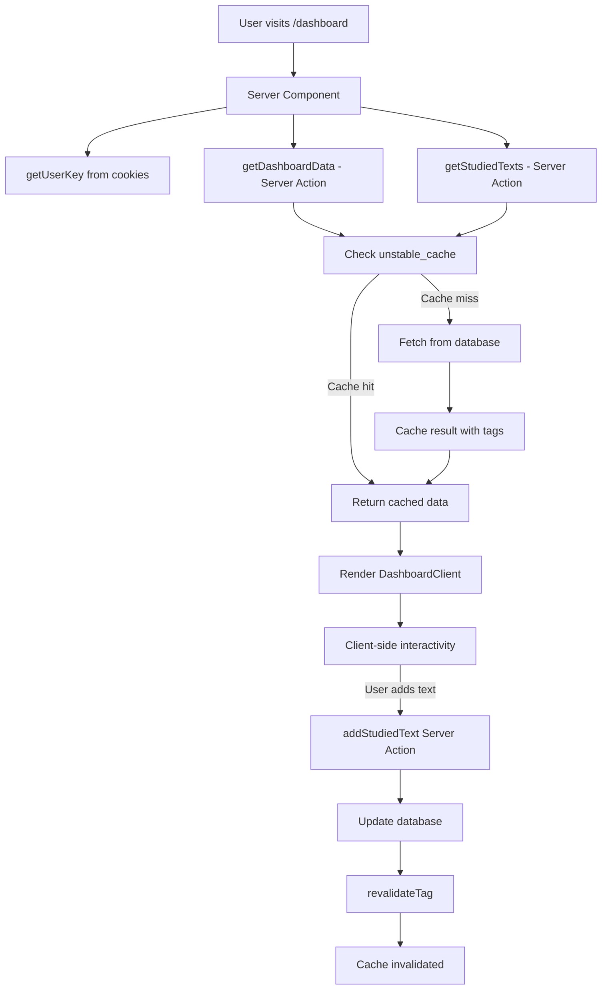

# 🏛️ Application Architecture

## Directory Structure

```
src/
├── app/                          # Next.js App Router
│   ├── layout.tsx               # Root layout (Server Component)
│   ├── page.tsx                 # Home page (Server Component)
│   ├── not-found.tsx            # 404 page
│   ├── sitemap.ts               # Dynamic sitemap
│   ├── dashboard/
│   │   ├── page.tsx            # Dashboard (Server Component)
│   │   ├── loading.tsx         # Loading skeleton
│   │   └── error.tsx           # Error boundary
│   ├── flashcards/
│   │   └── page.tsx            # Flashcards (Client Component)
│   └── api/                     # API Routes (backward compatibility)
│       ├── flashcards/
│       ├── gamification/
│       ├── sefaria/
│       └── studied-texts/
├── components/
│   ├── app/                     # App-level components
│   │   └── AppShell.tsx        # Navigation shell
│   ├── dashboard/               # Dashboard components
│   │   ├── DashboardClient.tsx # Main client component
│   │   ├── sections/           # Dashboard sections
│   │   └── hooks/              # Custom hooks (legacy)
│   └── ui/                      # Reusable UI components
├── contexts/                    # React contexts (legacy)
├── lib/                         # Utilities
│   ├── user-session.ts         # Cookie-based sessions
│   └── mock-data.ts            # Development data
└── server/                      # Server-side logic
    ├── actions/
    │   └── dashboard.ts        # Server Actions
    ├── db.ts                   # Prisma client
    ├── db/                     # Database utilities
    ├── flashcards/
    │   └── service.ts          # Flashcard logic
    └── gamification/
        └── service.ts          # Gamification logic
```

## Data Flow

### Dashboard Page Flow



### Caching Strategy

```
Layer 1: Next.js Page Cache (static pages)
  └─> Layer 2: unstable_cache (server data)
       └─> Layer 3: Prisma Query Cache
            └─> Layer 4: Database
```

## Component Boundaries

### Server Components (RSC)
- Data fetching
- Direct database access
- Environment variables
- No useState, useEffect, event handlers
- Smaller bundle (code stays on server)

**Examples:**
- `app/dashboard/page.tsx`
- `app/page.tsx`
- `app/layout.tsx`

### Client Components
- Interactivity (onClick, onChange)
- React hooks (useState, useEffect)
- Browser APIs (localStorage, window)
- Event handlers

**Examples:**
- `components/dashboard/DashboardClient.tsx`
- `components/dashboard/sections/*.tsx`
- `components/ui/*.tsx`

## Server Actions

### Definition
```typescript
"use server";

export async function actionName(data: Type) {
  // Server-side logic
  // Database operations
  // Cache invalidation
  return result;
}
```

### Usage in Client Components
```typescript
"use client";

import { actionName } from "~/server/actions/dashboard";

function Component() {
  const [isPending, startTransition] = useTransition();
  
  const handleAction = () => {
    startTransition(async () => {
      await actionName(data);
    });
  };
}
```

## Caching Patterns

### Read (with cache)
```typescript
export async function getData(key: string) {
  return unstable_cache(
    async () => {
      return await db.table.findMany();
    },
    [`cache-key-${key}`],
    {
      revalidate: 60,
      tags: [`user-${key}`],
    }
  )();
}
```

### Write (with invalidation)
```typescript
export async function updateData(data: Type) {
  const result = await db.table.create({ data });
  revalidateTag(`user-${data.userKey}`);
  return result;
}
```

## Security Layers

### 1. Middleware (`middleware.ts`)
- Rate limiting (100 req/min)
- Security headers
- Request validation

### 2. API Routes
- Zod input validation
- Error handling
- Authentication checks (future)

### 3. Server Actions
- Type-safe inputs
- Server-side validation
- Cache invalidation

### 4. Database
- Prisma (SQL injection protection)
- Proper indexing
- Connection pooling

## Performance Optimizations

### 1. Data Fetching
- ✅ Server Components for initial load
- ✅ Parallel fetching with Promise.all()
- ✅ Caching with revalidation
- ✅ Streaming with Suspense

### 2. Code Splitting
- ✅ Automatic with App Router
- ✅ Dynamic imports for heavy components
- ✅ Server/Client boundary optimization

### 3. Asset Optimization
- ✅ Font optimization with next/font
- ✅ Image optimization with next/image (ready)
- ✅ CSS optimization with Tailwind
- ✅ Bundle analysis (available)

### 4. Caching Strategy
- ✅ Page-level caching
- ✅ Data caching with tags
- ✅ Revalidation on mutation
- ✅ CDN-friendly headers

## Database Schema

### Key Tables
- **User**: User profiles and keys
- **Streak**: Daily streak tracking
- **Points**: Gamification points
- **Level**: User levels
- **Goal**: User goals and progress
- **StudySession**: Daily study sessions
- **StudiedText**: Texts user has studied
- **Flashcard**: Flashcard content
- **FlashcardReview**: Review scheduling

### Indexes
All frequently queried fields are indexed:
- `userKey` - Fast user lookups
- `userId, date` - Fast session queries
- `dueAt` - Fast due card queries
- `userId, earnedAt` - Fast points history

## Environment Variables

### Required
- `DATABASE_URL` - PostgreSQL connection string
- `NODE_ENV` - development | production

### Optional
- `NEXT_PUBLIC_URL` - Base URL for metadata

## Deployment

### Vercel (Recommended)
1. Connect GitHub repository
2. Set environment variables
3. Deploy automatically on push

### Docker
Use the Dockerfile in DEPLOYMENT.md

### Self-Hosted
```bash
pnpm install
pnpm db:migrate
pnpm build
pnpm start
```

## Monitoring

### Metrics to Track
- Response times (TTFB, LCP, FCP)
- Cache hit rates
- Database query performance
- Error rates
- Rate limit hits

### Recommended Tools
- Vercel Analytics (built-in)
- Sentry (error tracking)
- Database query monitoring
- Custom logging

## Development Workflow

### Local Development
```bash
pnpm dev         # Start dev server with Turbopack
pnpm db:push     # Sync schema to database
pnpm db:studio   # Open Prisma Studio
```

### Before Commit
```bash
pnpm typecheck   # Check TypeScript
pnpm lint        # Run ESLint
pnpm format:check # Check formatting
```

### Production Build
```bash
pnpm build       # Build for production
pnpm start       # Start production server
```

## Best Practices

### Do's ✅
- Use Server Components by default
- Fetch data in parallel
- Use proper caching strategies
- Validate all inputs with Zod
- Use TypeScript everywhere
- Implement error boundaries
- Add loading states

### Don'ts ❌
- Don't fetch on client unless necessary
- Don't use Context for server data
- Don't skip input validation
- Don't ignore TypeScript errors
- Don't use `cache: 'no-store'` by default
- Don't fetch in loops
- Don't skip error handling
